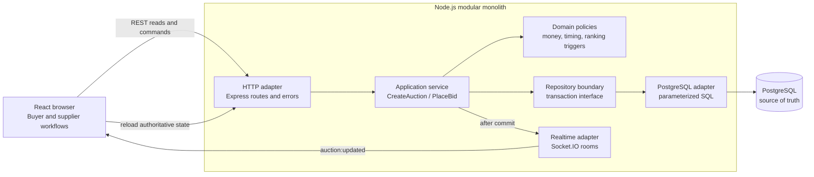
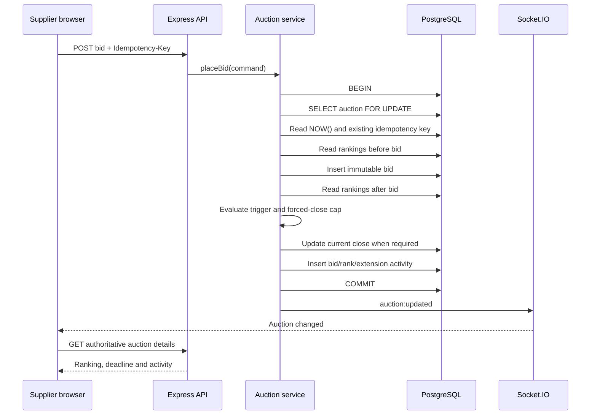

# High-Level Design — British Auction RFQ

Last updated: 28 July 2026

## Architectural goal

Build a focused system that is easy to run and extend, while protecting the invariants a production auction depends on:

- A late bid is never accepted.
- An extension never passes the forced close.
- A bid, its ranking effect, its extension, and its audit history agree.
- Two concurrent bids cannot make conflicting timing decisions.
- A browser retry does not create a duplicate bid.
- The database—not a browser clock or Socket.IO—is authoritative.

## Chosen style: modular monolith

The backend is one deployable Node.js application with explicit internal boundaries.

This is intentionally not a microservice system. The auction transaction crosses bids, rankings, deadlines, and activity history. Keeping those responsibilities in one process and one PostgreSQL transaction gives the system a clear consistency boundary. The internal boundaries still allow modules to be extracted later if load or team ownership justifies it.



## Module responsibilities

### HTTP adapter

- Parses HTTP input and headers.
- Applies the JSON size limit and CORS policy.
- Converts service results into status codes.
- Returns one stable error envelope.
- Adds a request ID for tracing.
- Contains no auction calculations and no SQL.

### Application service

- Orchestrates use cases.
- Starts the bid transaction through the repository boundary.
- Locks the selected auction.
- Reads database time.
- Calls pure domain policies.
- Writes audit events.
- Publishes a realtime notification only after commit.

### Domain policies

Small pure functions implement:

- Decimal-safe money conversion.
- Quote-total calculation.
- Trigger-window inclusion.
- Any-rank and L1-change detection.
- Extension calculation capped at forced close.
- Auction availability.

They do not know about Express, Socket.IO, or PostgreSQL, so the highest-risk rules are fast to test and straightforward to extend.

### PostgreSQL adapter

- Owns parameterized SQL and row mapping.
- Provides a transaction-scoped interface to the service.
- Uses `SELECT ... FOR UPDATE` to serialize bid decisions for one auction.
- Uses window functions to select each supplier’s latest bid and rank current quotations.
- Keeps all bid history immutable.

### Realtime adapter

- Maps one auction to one Socket.IO room.
- Sends a small “auction changed” event.
- Does not carry the authoritative ranking as application state.

The client reloads the REST representation after an event. This handles reconnection and missed events without creating a second source of truth.

## Critical bid flow



## Consistency and concurrency model

### Auction row lock

Every accepted bid locks its auction row. Bids for different auctions can proceed concurrently, while bids for the same auction are serialized for the short decision window.

This prevents two near-simultaneous requests from both evaluating the same old leader or close time.

### Database time

The service reads `NOW()` inside the transaction. Browser clocks only display the countdown. They never decide whether bidding is open.

### Idempotent commands

The client supplies an `Idempotency-Key`. PostgreSQL enforces uniqueness per auction. Retrying a request returns current state instead of inserting another bid.

### Decimal-safe money

The API validates at most two decimal places and converts values to integer cents for JavaScript calculations. PostgreSQL stores `NUMERIC(14,2)` and generates the total from charge components.

### Latest bid per supplier

Bid history is append-only. Ranking uses only each supplier’s latest bid. Current ranks are:

1. Total quote ascending
2. Earlier submission first for equal totals
3. Stable bid ID as the final deterministic tie-breaker

## API shape

| Method | Path | Purpose |
|---|---|---|
| GET | `/api/health` | Process liveness |
| GET | `/api/ready` | Database readiness |
| GET | `/api/auctions` | Auction repository |
| POST | `/api/auctions` | Create an RFQ auction |
| GET | `/api/auctions/:id` | Summary, ranking and activity |
| POST | `/api/auctions/:id/bids` | Submit an idempotent bid |

Error responses use:

```json
{
  "error": {
    "code": "AUCTION_CLOSED",
    "message": "Bidding is closed for this auction."
  },
  "requestId": "..."
}
```

## Failure handling

| Failure | Behaviour |
|---|---|
| Two suppliers bid together | Auction row lock serializes their decisions |
| Browser submits twice | Idempotency constraint prevents duplicate bid |
| Browser clock is wrong | Database time accepts or rejects the bid |
| Socket event is missed | Page load/reconnect reloads REST state |
| Process stops after commit but before emit | Data remains correct; reconnect reloads it |
| PostgreSQL is unavailable | Readiness fails; API returns a stable server error |
| Extension reaches forced close | New close is capped; future bids are rejected |

## Security posture

Implemented:

- Parameterized SQL only
- Central request validation
- 100 KB JSON body limit
- Explicit CORS origin
- Framework signature disabled
- Stable public errors without database details
- Request IDs and structured logs

Outside the current scope:

- Authentication and buyer/supplier roles
- RFQ participant authorization
- Rate limiting
- Secret management in a deployment platform
- TLS termination

Before production, supplier identity must come from authentication—not a carrier name sent by the browser.

## Scaling path

The initial system should stay a modular monolith.

When traffic or deployment topology requires it:

1. Add Redis only for the Socket.IO multi-instance adapter and distributed rate limiting.
2. Add a transactional outbox so realtime events survive a crash between database commit and publish.
3. Add a background closure worker if closing an auction must trigger awards or notifications exactly once.
4. Add read replicas only when reporting traffic justifies them; bid commands still use the primary.
5. Partition or archive activity history only after measured growth.

Microservices are not the first scaling step. The bid transaction should remain inside one transactional boundary until there is evidence that splitting it is worth the consistency cost.

## Extension examples

- Minimum bid decrement: add policy fields to `auctions`, validate against the supplier’s previous quote in the locked transaction.
- Multiple lanes/lots: introduce `auction_lots` and `lot_bids`; lock the lot being bid on.
- Hidden supplier identities: keep the schema, change response mapping according to the viewer’s role.
- Maximum extension count: add `extension_count` and `max_extensions`, update atomically with the close time.
- Award workflow: append `awards` and `award_approvals`; do not mutate bid history.
